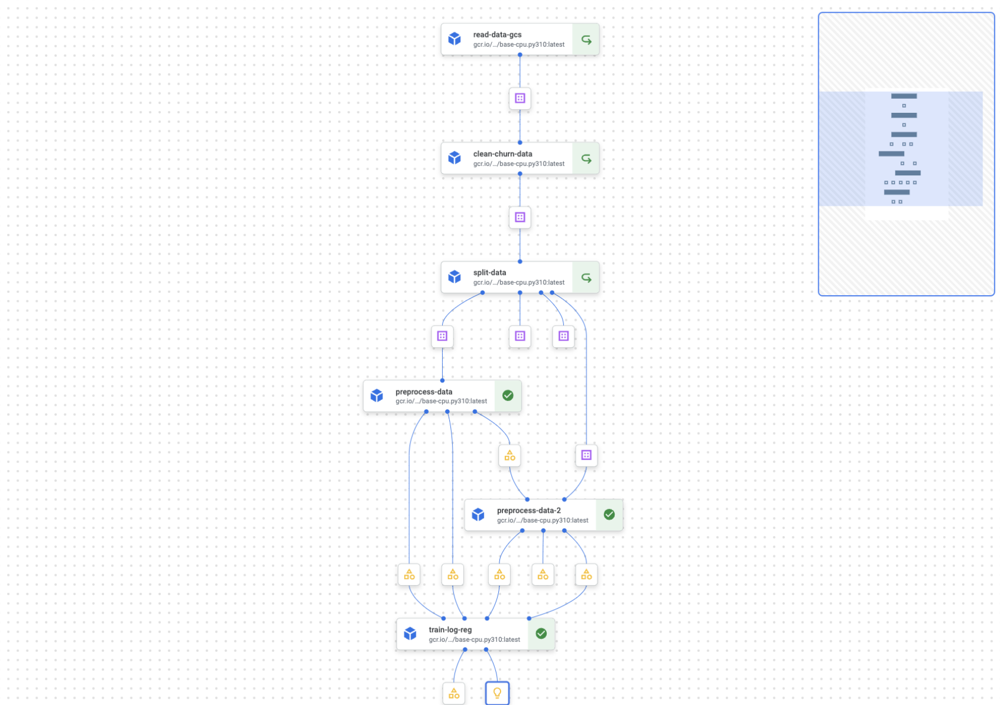
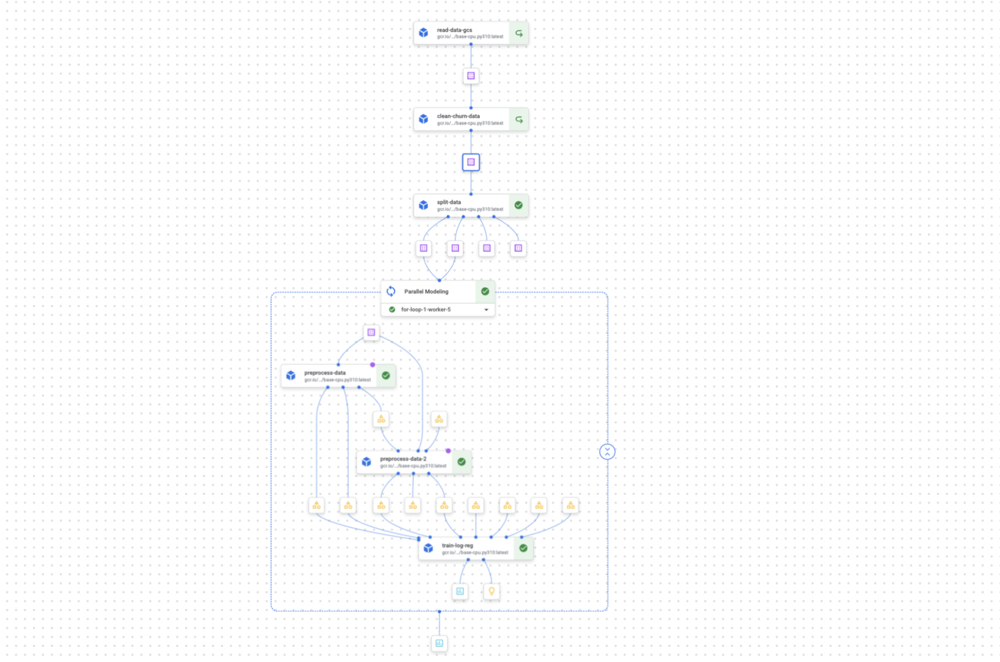
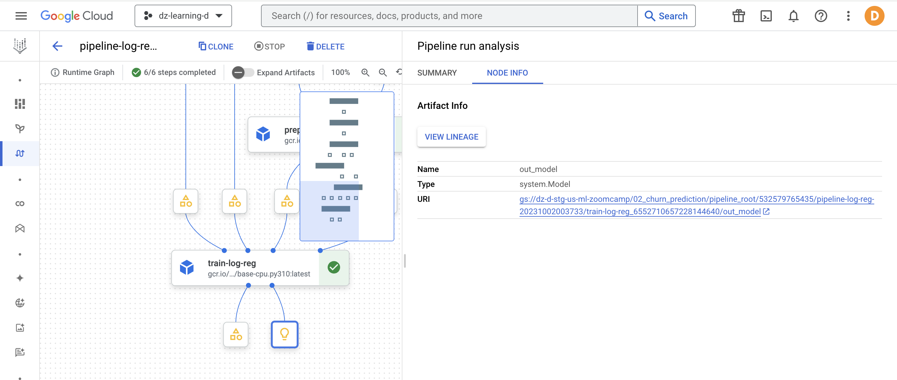
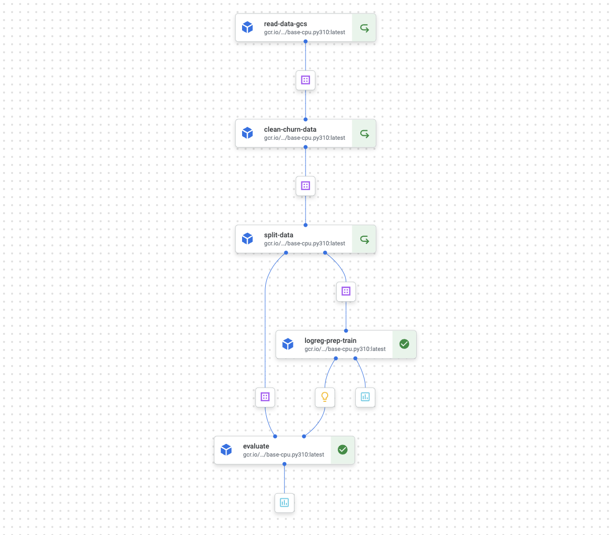
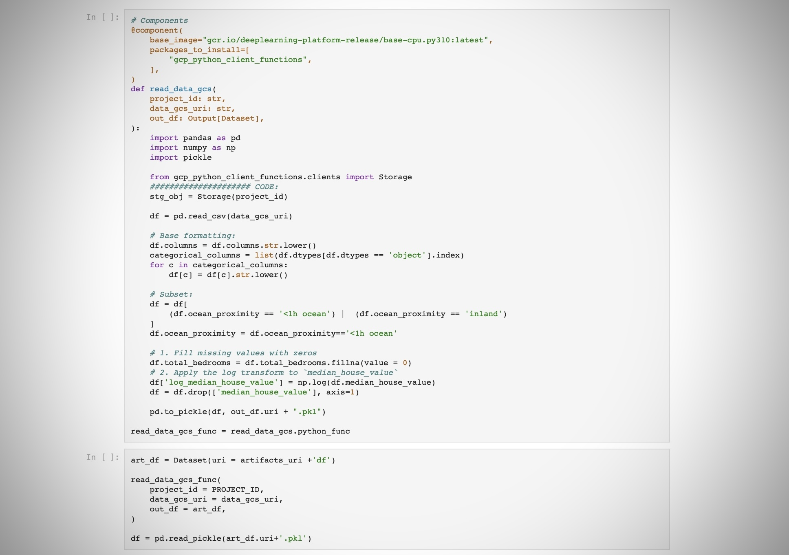
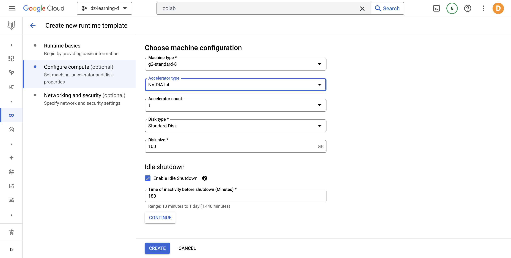
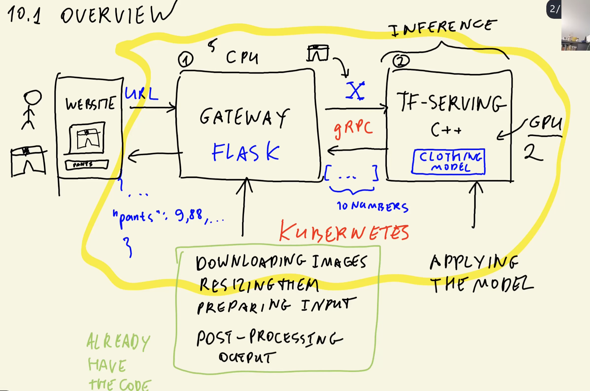
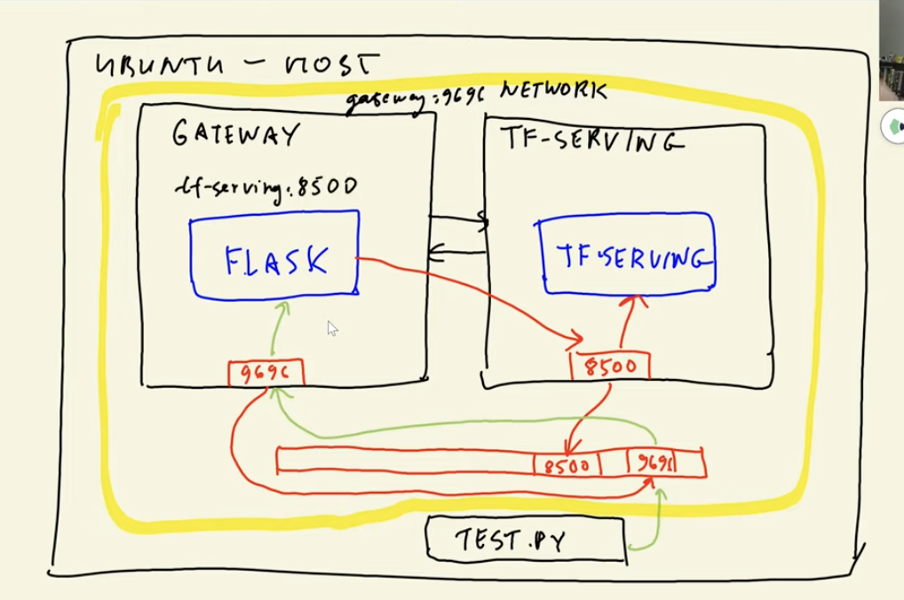
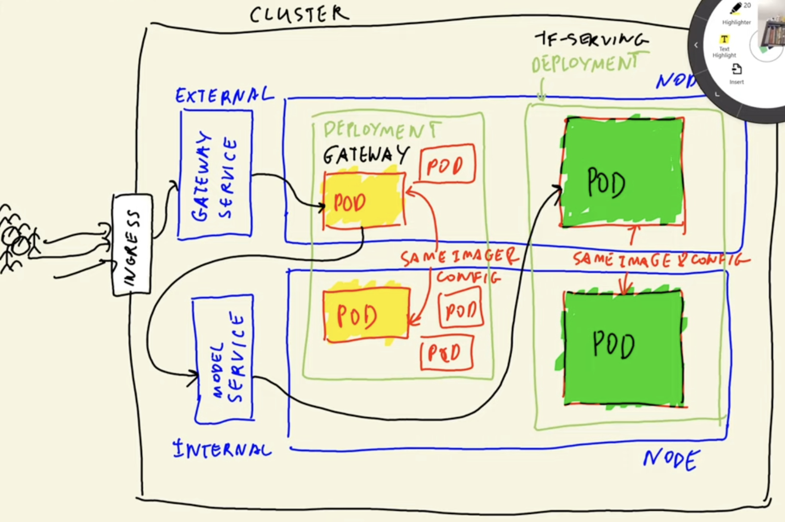

## 🔍 About

Sessions and tasks of the **DataTalksClub💬** [Machine Learning Zoomcamp](https://github.com/DataTalksClub/machine-learning-zoomcamp) but with [Google Cloud Platform](https://console.cloud.google.com).


## 🚀 Content

### 0️⃣ Introduction

[**[Nb] Introduction**](nbs/theory/00_intro.ipynb) covers a quick example to explain what Machine Learning is, goes over the difference between ML and traditional programming, defines Supervised Learning, what the stages in a Machine Learning project are (according to the CRISP-DM methodology), deep dives into the stage of Model Selection, and introduces to important ML tools such as linear algebra, and the Numpy/Pandas libraries. 

---

### 1️⃣ Linear Regression with BigQuery

[**[Nb] Linear Regression**](nbs/theory/01_linear_regression.ipynb) covers theory + implementation of Linear Regression for the [Car Prices Kaggle dataset](https://www.kaggle.com/datasets/CooperUnion/cardataset?resource=download) using `bigframes` Pandas DataFrames and BigQuery ML. More about the tool on [BigQuery DataFrames Official Docs](https://cloud.google.com/python/docs/reference/bigframes/latest).

---

### 2️⃣ Classification with Vertex Pipelines  

This section covers the topic of Classification problems using the Python Scikit-learn framework and Vertex AI pipelines (more about [Vertex Pipelines in Google Official Docs](https://cloud.google.com/vertex-ai/docs/pipelines/introduction)).

- **[[Nb 1] Churn Prediction Example](nbs/theory/02_churn_pred.ipynb) and [[Nb 2] Churn Prediction with Vertex](nbs/theory/02_churn_pred_vertex.ipynb)**: both notebooks focus on implementing a Churn Prediction classification model with the [Telco customer churn Kaggle Dataset](https://www.kaggle.com/datasets/blastchar/telco-customer-churn). The **first notebook** goes over the theory of Churn prediction problems and how to solve them with ML. Also, starts exploring the data and modeling following the best practices that will later allow the easy creation of operational code (working with Python containerized functions that will later allow the creation of vertex orchestration pipelines). In the **second notebook🌟**, we transform the previous code into component and pipeline code.
      

- **[[Nb 3] Classification with Vertex](nbs/homework/02_classification_vertex.ipynb)**: notebook takes the code from [[Nb 2] Churn Prediction with Vertex](nbs/theory/02_churn_pred_vertex.ipynb) and modifies it to create the pipeline for another classification problem (benefit from working with reusable components). We create a training pipeline that predicts if the price of a car will be above average, using the same dataset as in the "Linear Regression" section. We also leverage the use of component parallelization to train different models and compare the results.
     

---

### 3️⃣ Evaluation Metrics for Classification

[**[Nb] Evaluation Metrics for Classification**](nbs/theory/03_eval_classification.ipynb) continues with the Telco Churn Prediction example, exploring different evaluation metrics such as the accuracy, Confusion Matrix, Precision, Recall, ROC curve (AUC ROC curve), and methods as K-fold validation. This notebook takes the definitions from [Google Developers Machine Learning Glossary](https://developers.google.com/machine-learning/glossary) and provides both manual implementations (to deeply understand each concept), and then with scikit-learn. 

Here, we use the model and data artifacts saved in the run of our previous churn prediction pipeline (artifacts are automatically saved in Google Cloud Storage).



We additionally have a cleaner version of the functions in this section's Homework Notebook [[Nb] Evaluation for Car Price Dataset](nbs/homework/03_evaluation.ipynb).

---

### 4️⃣ Model Deployment (Training Pipeline & Prediction Container)

We previously worked on a churn prediction project and developed it side by side with the pipeline that would operationalize the training (developed in notebooks). So, this section formalizes what we started in [[Nb] Churn Prediction with Vertex](nbs/theory/02_churn_pred_vertex.ipynb).

The steps we followed:
1. Ensure environment with `pipenv`.
    ```
    pip install pipenv
    ```
    ```
    pipenv install -r requirements.txt
    ```
    ```
    pipenv shell
    ```
1. Convert the notebook to a structured set of scripts that use the [kubeflow library](https://www.kubeflow.org/docs/components/pipelines/v2/introduction/) to create the training Vertex components and pipeline (we made some edits to the structure of the pipeline and tested it in the [[Nb] Deployment](nbs/theory/04_deployment.ipynb)). Scripts in `src/theory/04_deployment`:
    1. **Components (`components/`):** kubeflow components to read data, clean it, split it, train a log regression model with k-fold validation, evaluating the model.
    1. **Pipeline (`training_pipeline.py`):** placing all the components together.
    1. **Run pipeline (`run_pipeline.ipynb`):** file where we read the pipeline, compile it, and run it using the Vertex AI SDK (more on how to [Build and Run Vertex Pipelines in the Official Docs](https://cloud.google.com/vertex-ai/docs/pipelines/run-pipeline)).

    Resulting training pipeline:

    

1. Create a flask app to predict with our resulting model and prepare it with `gunicorn` for production ([docker/theory/04_deployment/predict.py](docker/theory/04_deployment/predict.py)).
1. Test the flask app **locally** in the `predict_test` notebook:
    1. Create a jupyter kernell for the environment:
        ```
        python -m ipykernel install --user --name=env-ml-zoomcamp
        ```
    1. Start webapp with `gunicorn`:
        ```
        cd docker/theory/04_deployment   
        gunicorn --bind 0.0.0.0:8080 predict:app
        ```
    1. Run code in [docker/theory/04_deployment/predict_test.ipynb](docker/theory/04_deployment/predict_test.ipynb).

1. Wrap our flask app in a container:
    1. Create a docker file ([docker/theory/04_deployment/Dockerfile](docker/theory/04_deployment/Dockerfile)) that installs our requirements, copies our app and model, and starts the webapp.
    1. Build the docker container.
        ```
        docker build -t zoomcamp-test .
        ```
    1. Run our container exposing the prediction port:
        ```
        docker run -it --rm -p 8080:8080 zoomcamp-test
        ```
    1. Run code in [docker/theory/04_deployment/predict_test.ipynb](docker/theory/04_deployment/predict_test.ipynb).

1. Possible future steps: 
    - Use this custom container to deploy your model to a Vertex AI endpoint (see [Deploy a model with Flask on GCP Vertex AI](https://medium.com/nlplanet/deploy-a-pytorch-model-with-flask-on-gcp-vertex-ai-8e81f25e605f=).
    - Adapt pipeline to add deployment components after training (with evaluation condition). See the [Step-by-Step Guide to Creating and Deploying Custom ML Pipelines with GCP Vertex AI ](https://medium.com/@wardarahim25/step-by-step-guide-to-creating-and-deploying-custom-ml-pipelines-with-gcp-vertex-ai-part-2-3be6e314bc48) article and the [Vertex AI: Use custom prediction routines with Sklearn to preprocess and postprocess data for predictions](https://codelabs.developers.google.com/vertex-cpr-sklearn#5) lab.

---

### 5️⃣ Decision Trees

In this section, we focus on learning the theory behind Decision Trees 🌳, Bagging and boosting methods (Random Forest, Gradient Boosting, and XGBoost). The [first notebook]((nbs/theory/05_trees.ipynb)) focuses on the theory and implementation (training/evaluation/hyperparameter tuning) and the [second homework notebook](nbs/homework/05_trees.ipynb) reinforces the knowledge in a different dataset.

In both notebooks, we write KFP components for our implementations and practice the local testing of these components. You will see how we take the Python function of the components and instantiate KFP artifacts to pass along our functions (more on [KFP Artifacts on the Official Docs](https://www.kubeflow.org/docs/components/pipelines/v2/data-types/artifacts/)). 



This is a good practice when working with updates and testing of Vertex pipelines. This way, you work with the same code and avoid the need to make any updates two times (to your testing code and to your pipeline code). 

---

### 6️⃣ Tensorflow  

In this section, we focused on learning the basic concepts of Deep Learning and the Tensorflow framework. We created a [notebook](nbs/homework/06_tensorflow.ipynb) where we're using a neural network to predict if an image contains a Bee or a Wasp (using the ["Bee or Wasp" Kaggle Dataset](https://www.kaggle.com/datasets/jerzydziewierz/bee-vs-wasp/code)). We used [Google Colaboratory](https://colab.research.google.com/?utm_source=scs-index) to leverage the use of **free GPUs**. Also, Colab creates a seamless experience to start working with Machine Learning projects (without worrying about the compute or environment).

A private alternative to Colaboratory is Enterprise Colab, where you can create runtimes for people in your organization with the appropriate compute for different projects.




> **Note:** in this homework we didn't talk about hyperparameter tuning for our networks, in this case we can leverage the Hyperparameter Tuning service offered by Vertex. Example code: [GCP Official Hyperparameter Tuning Tensorflow Notebook](https://github.com/GoogleCloudPlatform/vertex-ai-samples/blob/main/notebooks/official/training/hyperparameter_tuning_tensorflow.ipynb).

---

### 7️⃣ Kubernetes

In this section, we work with a TensorFlow classification model to predict the type of clothes displayed in an image. The next image shows an overview of the expected service.  


We created two docker images:  
1. One that has a `TF-Serving` base image and contains the `saved_model` version of a fine-tuned [Xception](https://keras.io/api/applications/xception/) model found in the [machine-learning-zoomcamp repo](https://github.com/DataTalksClub/machine-learning-zoomcamp/releases/tag/chapter7-model).
2. Another one that contains a flask app to preprocess an image (converting to `protobuf` format), sends a request to a `TF-serve PredictionServiceStub`, and post-processes the response to return a `json` with the predictions.

We additionally tested these images individually, and the used [Docker Compose](kubernetes/theory/docker-compose.yml) to test the interaction between them.

We finally set up a local [Kubernetes](https://kubernetes.io/) cluster using `kind` and used `kubectl` to interact with it.

> **Note:** To install `kind` in MacOS: `brew install kind`  

> **Note:** `kubectl` Comes with docker desktop (if not, you can install from https://kubernetes.io/docs/reference/kubectl/)

Using Kubernetes allows us to decouple the pre/post-processing tasks from the model inference task at inference time, being able to adapt computing resources accordingly (additionally, Kubernetes will autoscale given the load).



Elements in the image:
- **Node:** server/computer (ex. ec2 instance)  
- **Pod:** docker container (run on a node)  
- **Deployment:** group of pods with the same image & config.  
- **Service:** responsible for routing the request (entry point of an application and routes requests to pods).  
    - External: load balancer  
    - Internal: cluster ip
- **Ingress:** The entry point to the cluster.
- **HPA:** horizontal pods autoscaler.

> **Note:** install Kubernetes VSCode extension to easily create deployment and service configuration files.

> **Note:** created a Makefile with used commands (for docker and kubernetes).

Tomorrow:
- Upload to GKE
- Homework

## 📞 Contact

Find the links to contact me on my site: https://datasciencedani.super.site 🙋🏽‍♀️