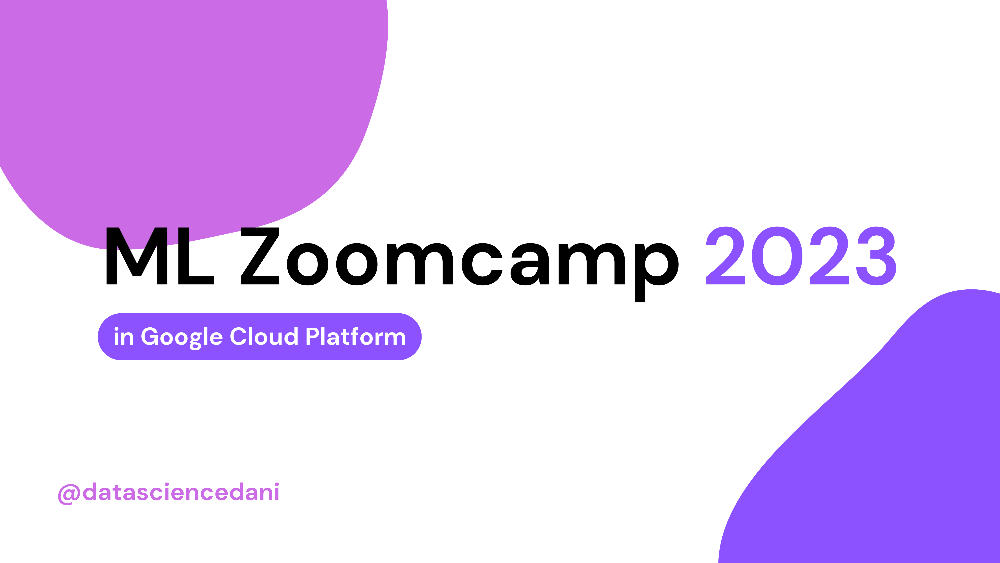

## 🔍 About

Sessions and tasks of the **DataTalksClub💬** [Machine Learning Zoomcamp](https://github.com/DataTalksClub/machine-learning-zoomcamp) in [Google Cloud Platform](https://console.cloud.google.com).

## 🚀 Content

[**🎬 [Nb] Introduction**](nbs/theory/00_intro.ipynb): notebook that covers a quick example to explain what Machine Learning is, goes over the difference between ML and traditional programming, defines Supervised Learning, what the stages in a Machine Learning project are (according to the CRISP-DM methodology), deep dives into the stage of Model Selection, and introduces to important ML tools such as linear algebra, and the Numpy/Pandas libraries. 

[**📈 [Nb] Linear Regression with BigQuery**](nbs/theory/01_linear_regression.ipynb): notebook that covers theory + implementation of Linear Regression for the [Car Prices Kaggle dataset](https://www.kaggle.com/datasets/CooperUnion/cardataset?resource=download) using `bigframes` Pandas DataFrames and BigQuery ML. More about the tool on [BigQuery DataFrames Docs](https://cloud.google.com/python/docs/reference/bigframes/latest).

**👆🏽 Classification with Vertex AI**: notebooks that cover the topic of Classification problems using the Python Scikit-learn framework and [Vertex AI pipelines](https://cloud.google.com/vertex-ai/docs/pipelines/introduction).

- **[[Nb] Churn Prediction Example](nbs/theory/02_churn_pred.ipynb) and [[Nb] Churn Prediction with Vertex](nbs/theory/02_churn_pred_vertex.ipynb)**: notebooks focus on implementing a Churn Prediction classification model with the [Telco customer churn Kaggle Dataset](https://www.kaggle.com/datasets/blastchar/telco-customer-churn). The first notebook goes over the theory of Churn prediction problems and how to solve them with ML. Also, starts exploring the data and modeling following the best practices that will later allow the easy creation of operational code (with vertex orchestration pipelines). In the second notebook🌟, we transform the previous code into component and pipeline code.
      

- **[[Nb] Classification with Vertex](nbs/homework/02_classification_vertex.ipynb)**: notebook takes the code from [[Nb] Churn Prediction with Vertex](nbs/theory/02_churn_pred_vertex.ipynb) and modifies it to create the pipeline for another classification problem (benefit from working with reusable components). We create a training pipeline that predicts if the price of a car will be above average, using the same dataset as in the "Linear Regression" section. We also leverage the use of component parallelization to train different models and compare the results.
     