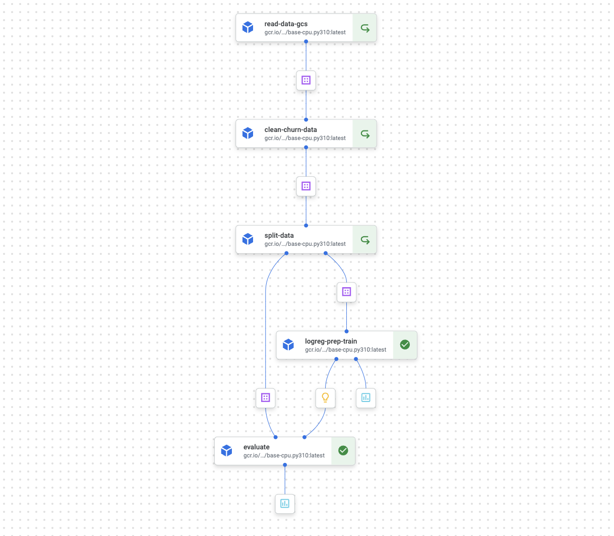

## Model Deployment 

We previously worked on a churn prediction project and developed it side by side with the pipeline that would operationalize the training. 

[This chapter](https://github.com/DataTalksClub/machine-learning-zoomcamp/blob/master/05-deployment) of the zoomcamp focuses on model deployment, so what we are going to formalize what we started in the [Churn Prediction with Vertex nb](../../nbs/theory/02_churn_pred_vertex.ipynb).

The steps we will follow are:
1. Convert our notebook to a structured set of scripts (we made some edits to the structure of the pipeline and tested it in the [Deployment nb](../../../nbs/theory/04_deployment.ipynb)). 

        
    

    Scripts in `src/theory/04_deployment`:
    1. **Components (`components/`):** read data, clean it, split it, train a log regression model with k-fold validation, evaluating the model.
    1. **Pipeline (`training_pipeline.py`):** placing all the components together.
    1. **Run pipeline (`run_pipeline.ipynb`):** reads the pipeline, compiles it, and runs it.

1. Create a flask app to predict with our resulting model and prepare it with `gunicorn` for production ([folder with files](../../../docker/theory/04_deployment)).

1. Ensure environment with `pipenv`.
    ```
    pip install pipenv
    ```
    ```
    pipenv install -r requirements.txt
    ```
    ```
    pipenv shell
    ```
1. Test out flask app in the `predict_test` notebook.
    1. Create a jupyter kernell for the environment:
        ```
        python -m ipykernel install --user --name=env-ml-zoomcamp
        ```
    1. Start webapp with `gunicorn`:
        ```
        cd docker/theory/04_deployment   
        gunicorn --bind 0.0.0.0:9696 predict:app
        ```
    1. Run code in `predict_test.ipynb`.

1. Wrap our flask app in a container.
    1. Create a docker file that installs our requirements, copies our app and model, and starts the webapp.
    1. Build the docker container.
        ```
        docker build -t zoomcamp-test .
        ```
    1. Run our container exposing the prediction port:
        ```
        docker run -it --rm -p 8080:8080 zoomcamp-test
        ```
    1. Run code in `predict_test.ipynb`.

1. Next steps: 
    1. Use this custom container to deploy your model to a Vertex AI endpoint (see [Deploy a model with Flask on GCP Vertex AI](https://medium.com/nlplanet/deploy-a-pytorch-model-with-flask-on-gcp-vertex-ai-8e81f25e605f=).
    1. Adapt pipeline to add deployment components after training (with evaluation condition). See the [Step-by-Step Guide to Creating and Deploying Custom ML Pipelines with GCP Vertex AI ](https://medium.com/@wardarahim25/step-by-step-guide-to-creating-and-deploying-custom-ml-pipelines-with-gcp-vertex-ai-part-2-3be6e314bc48) article and the [Vertex AI: Use custom prediction routines with Sklearn to preprocess and postprocess data for predictions](https://codelabs.developers.google.com/vertex-cpr-sklearn#5) lab.